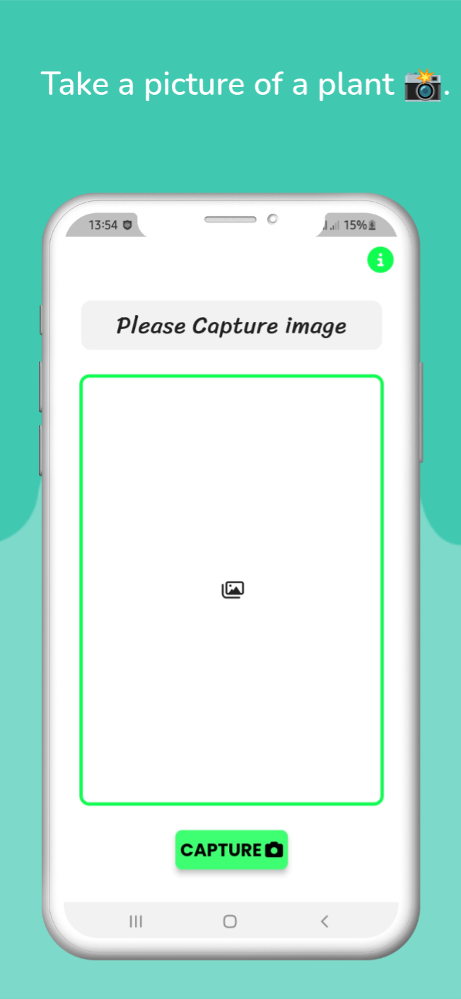
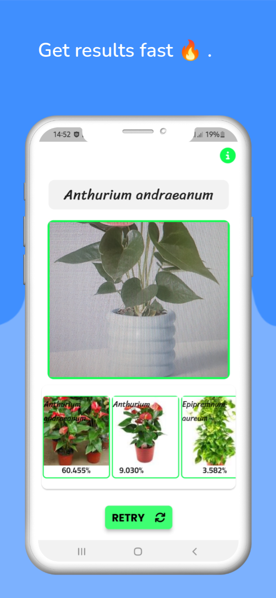

### Preview
Our project uses image analysis techniques to determine the medicinal properties of leaves through preprocessing, CNN classification, clustering, segmentation, and feature extraction. Performance is evaluated using metrics such as accuracy and error rate.

| Screenshot 1 | Screenshot 2 | Screenshot 3 |
| :-------------------------------------: | :-------------------------------------: |  :--------------------------------------: |
|  |  |  |

---

  

  

  

 

